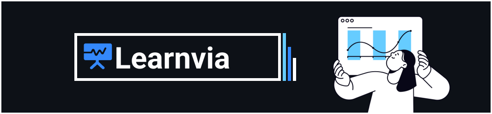

# Learnvia

Learnvia is an interactive learning platform designed primarily for university students studying software engineering. It moves beyond passive, video-based learning by focusing on a more engaging and effective approach that involves reading, understanding, practicing, and testing.

The platform is structured as a monorepo containing the core applications:

-   `/admin`: The admin dashboard for managing courses, users, and content.
-   `/backend`: The backend API that powers the platform.
-   `/web`: The main user-facing web application where students learn.

## Core Concepts

-   **Active Learning Flow:** Users enroll in courses and progress through a structured sequence of content, including notes, scrollable videos, MCQs, and flashcards.
-   **Progress Tracking:** Students "check-in" after completing a chapter to mark their progress and move on to the next subtopic.
-   **Goal-Oriented:** The primary goal is not just content consumption, but to ensure users are actively learning and can test their knowledge effectively.

## Getting Started

### Prerequisites

Make sure you have [Node.js](https://nodejs.org/) installed on your system.

### Installation

1.  Clone the repository.
2.  Install the dependencies from the root directory:
    ```bash
    npm install
    ```

### Running the Development Environment

This project includes helper scripts to manage the monorepo environment.

-   **To manage environment variables:**
    This script helps you set up the necessary `.env` files for each application (`admin`, `backend`, `web`).
    ```bash
    npm run env
    ```

-   **To start all development servers concurrently:**
    This command will launch the `admin`, `backend`, and `web` applications in development mode.
    ```bash
    npm run dev
    ```

## License

This project is licensed under the **ISC License**.

## Author

Created by **Elight-Group**.
